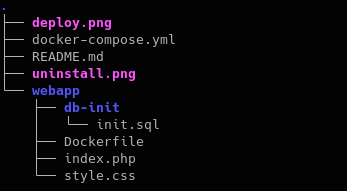
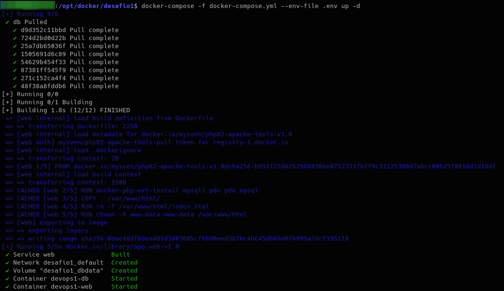
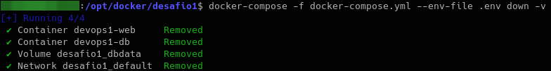

# Desafio 2 del Modulo 4 - Bootcamp Devops Engineer <br><br>
### Contenido del directorio:

 <br>


El link de la imagen tagueada en dockerhub es la siguiente:  https://hub.docker.com/repository/docker/mysven/php82-apache-tools/general <br><br><br>


### Para desplegar el docker-compose se deben seguir los siguientes pasos: <br><br>

1 - Editar las variables de entorno del archivo .env con los datos deseados (por ejemplo las contraseñas de los usuarios de la DB) <br><br>

```bash
1.   MYSQL_ROOT_PASSWORD=password_root
2.   MYSQL_DATABASE=nombre_db
3.   MYSQL_USER=usuario_db
4.   MYSQL_PASSWORD=password_usuario_db
```
<br><br><br>

2 - Para construir la app se debe ejecutar el siguiente comando:
```bash
   docker-compose -f docker-compose.yml --env-file .env up -d  
```   
     <br><br><br>
    

### Para el uninstall de la app y los volúmenes simplemente se debe ejecutar el siguiente comando:
```bash   
   docker-compose -f docker-compose.yml --env-file .env down -v     
```   
      <br><br><br><br><br><br><br><br>  
