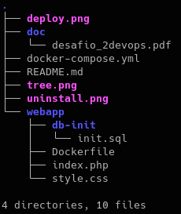

# Desafio 2 del Modulo 4 - Bootcamp Devops Engineer <br><br>
Contenido del directorio:




El link de la imagen tagueada en dockerhub es la siguiente:  https://hub.docker.com/repository/docker/mysven/php82-apache-tools/general


Para desplegar el docker-compose se deben seguir los siguientes pasos:

1 - Editar las variables de entorno del archivo .env con los datos deseados (por ejemplo las contraseñas de los usuarios de la DB)

2 - Para construir la app se debe ejecutar el siguiente comando:
```bash
   docker-compose -f docker-compose.yml --env-file .env up -d  
```   
   
    

Para el uninstall de la app y los volúmenes simplemente se debe ejecutar el siguiente comando:
```bash   
   docker-compose -f docker-compose.yml --env-file .env down -v     
```   
        
